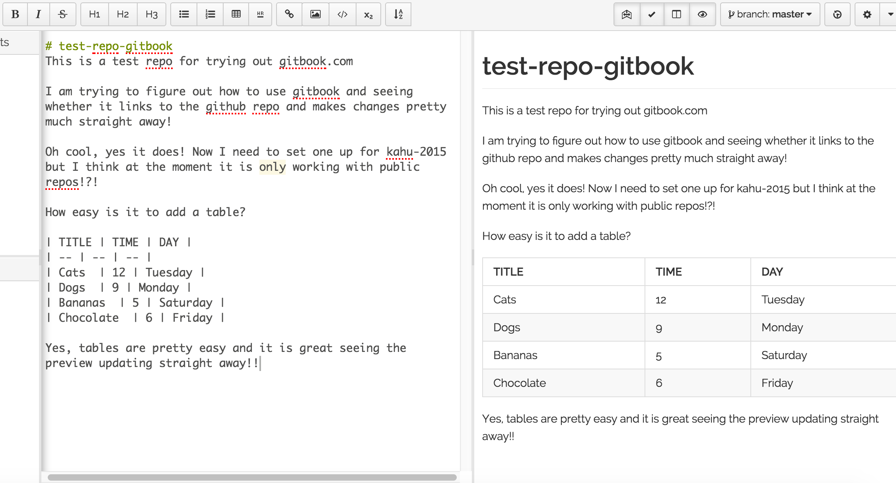

# test-repo-gitbook
This is a test repo for trying out gitbook.com

I am trying to figure out how to use gitbook and seeing whether it links to the github repo and makes changes pretty much straight away!

Oh cool, yes it does! Now I need to set one up for kahu-2015 but I think at the moment it is only working with public repos!?!

How easy is it to add a table?

| TITLE | TIME | DAY |
| -- | -- | -- |
| Cats  | 12 | Tuesday |
| Dogs  | 9 | Monday |
| Bananas  | 5 | Saturday |
| Chocolate  | 6 | Friday |

Yes, tables are pretty easy and it is great seeing the preview updating straight away!!

Oh and adding a image! Sweet as easy! Cool!

Now I just need to figure out how to add other files and link to them.

